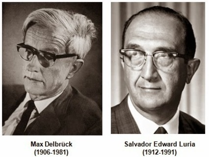
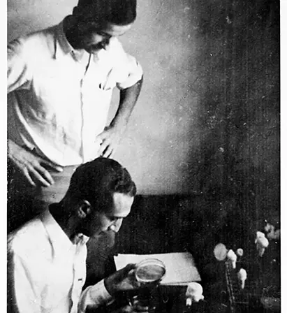
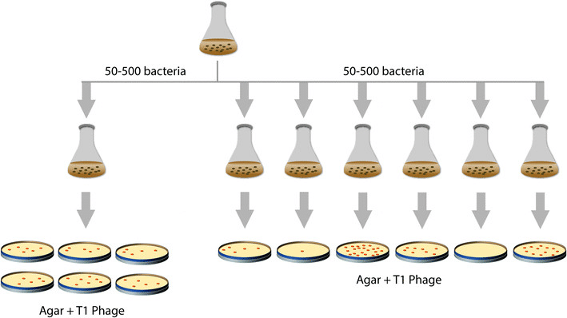

```{r, setup, include=FALSE}
knitr::opts_chunk$set(
  #class.source = "numberLines lineAnchors",
  cache = TRUE
)
```

\pagenumbering{gobble}

```{r, echo = F,out.width = '70%', fig.align = "center"}
knitr::include_graphics("figs/slot_machines.jpg")
```


\newpage
\setcounter{tocdepth}{2}
\tableofcontents 


\newpage
\pagenumbering{arabic}

# Introduction


**Are mutations induced by environment or do they arise spontaneously?**
This was the question faced by Salvador Lauria and Max Delbrück ^[For interested readers: ["the Phage group"](https://en.wikipedia.org/wiki/Phage_group)] (Fig. \ref{fig:ld_2}) in 1943 when they devised their seminal fluctuation test experiment.
For historical context, this was 30 years after @sturtevant_linear_1913 performed gene mapping in *Drosophila*, around the same time as @avery_studies_1944 found nucleic acid instead of protein was responsible for transformation of Pneumococcus, almost 10 years before DNA was confirmed to be genetic material by @hershey_independent_1952 and the structure of DNA was solved by @watson_molecular_1953, and more than 20 years before the neutral theory of molecular evolution was proposed by @kimura_evolutionary_1968.


The inspiration for such a question comes from observing the interaction between bacteria and bacteriophages (i.e. viruses that infect bacteria).
A colony of bacteria growing in a flask will eventually turn the medium in the flask cloudy as the number of cells increases.
It was noted that adding an equal number of phages to the flask would clear the water, as the phages lysed open the bacterial cells.
However, after some time the medium in the flask would become cloudy again.
This is because some bacteria became resistant to the phage by mutation.
The question was then "how did these resistance mutations come about?"


<!--
```{r, echo = F, fig.cap="Luria and Delbrück", out.width = '50%', label = "ld_1", fig.align = "center"}

```
-->

```{r, echo = F, fig.cap="Luria and Delbrück", out.width = '40%', label = "ld_2", fig.align = "center"}

```


@luria_mutations_1943 proposed a simple experiment to distinguish two competing models for the origin of resistant mutants:

1. Induced/acquired mutation: Mutations occurred in the bacteria by exposure to the phage resulting in resistance 
1. Spontaneous mutations: Mutations occurred spontaneously during growth, and bacteria carrying these mutations were already resistant prior to exposure to the phage 


To determine which model was correct, they devised an experiment known as the fluctuation test (Fig. \ref{fig:ld_exp}).
This test proceeded as follows:


First a colony of non-resistant bacteria were grown in a flask.
These bacteria were then used to inoculate media in (e.g. 11) identical test tubes.
The bacteria were then allowed to grow in these test tubes until they were at a certain cell density.
The test tubes were then split into two groups - for the purposes of this notebook, we will call these groups A and B.
One tube was put into group A, and from this tube 10 plates, already containing phages, were inoculated with bacteria.
The other 10 tubes constituted group B, and from each tube a single plate, again containing phages, was inoculated with bacteria.
The number of resistant colonies were then counted on each plate.


```{r, echo = F, fig.cap="Luria-Delbrück experiment", out.width = '100%', label = "ld_exp"}

```

If the first model (induced mutation by exposure to phages) is true, then we would expect that the variance in the number of resistant colonies per plate would be the same for experiment A and B.
This is because resistance is induced at a certain rate once the bacteria are plated out, and would not depend on what had happened while the bacteria grew in the test tubes.
In other words, each plate would be an independent sample, regardless of if the bacteria came from the same test tube or not - hence equal variances.

If the second model (spontaneous mutations in tubes before exposure to phages) is true, then we would expect the variance to be far greater for experiment B than for experiment A.
This is due to the fact that the resistance mutation occurs spontaneously during growth in the test tube.
When plating out experiment A, the number of resistant colonies is representative of the frequency of resistance in the single tube, so each plate is not independent.
On the other hand, in experiment B each tube has had an independent phase of growth, during which resistance may have spontaneously evolved early on, resulting in a high frequency of resistant colonies, or later on, resulting in few resistant colonies.
In other words, because the number of cells increase exponentially during the growth, depending on the timing of mutation the number of resistant cells at the end point should vary by orders of magnitudes, manifested as larger variance in experiment B than in A.


When @luria_mutations_1943 performed this experiment, mathematical analysis was conducted to obtain expectation for both models.
By comparing the experimental results and the theory they developed, they found that the spontaneous mutation model is true. 
However, what if you, a curious biologist equipped with neither the strongest mathematical training nor interest, were in their place?
How would you decide on the specifics of this experiment?
How many replicates would you need, or how many bacteria would you plate out?
How many generations would need to be run to see an effect at the mutation rate you would expect?
Additionally, the experiment relies on the assumption that there is no standing genetic variance for resistance in the ancestral bacteria.
How would violating this assumption affect the results?


Be happy that we are in 2024.
To answer these questions and gain an intuition for (the limitations of) this experimental design, lets simulate!!


But how can we go about simulating something like this?
Here is a recommendation for how to start with a simulation in general:

1. **Make your question and hypotheses as concrete as possible**.
1. **Design an experiment** that should answer your question by testing your hypotheses.
1. **Develop a good mental/visual/verbal model of steps of the experiment.** Make sure you understand the biology and the technical aspects of what you want to simulate.
1. **Break it down into subprocesses** What are the different steps involved going from initialization to final product?
Describe in (painful) detail how each subprocess works - pretend like you have to describe it to an alien who has never been to Earth and knows nothing how the subprocess works.
<!--No detail is too insignificant!-->Be sure to think about potential biases.
1. **Convert those descriptions into pseudocode**, keeping in mind which data structures you will use - think about which functions you will use where, and how you will store and manage your data.
What is an efficient way to code this process? Do this with a pen and paper to figure out exactly how your algorithm will work.
1. **Make the pseudocode actual code**


Lets see how we can do this for the Luria-Delbrück experiment
For now we will just focus on the 2nd model, the one of spontaneous mutation.


For the Luria-Delbrück experiment, the subprocesses and their descriptions are:

0. Initializing an ancestral population
   + Create a flask with a large population of non-resistant bacteria
1. Sampling the ancestral population to create the test tubes
   + Randomly choose $n_0$ cells from the ancestral flask and put these cells into new medium. Create 1 tube for experiment A and $r$ tubes for experiment B.
1. Growing the cultures
   + In each generation, every cell produces two children cells.
   + When the children cells are formed, there is a chance that each child will mutate some resistance.
   + These children then become the parents for the next generation.
   + This process repeats for T generations.
1. Plating out
   + Experiment A:
      + Sample $n_{sample}$ cells without replacement from the same tube for each of $r$ plates
   + Experiment B:
      + Randomly sample n_sample cells without replacement from each of r tubes to create each of r plates
1. Computing the variance
   + For each plate, count the number of resistant colonies, then calculate the variances for experiments A and B.


# Implementation of spontaneous mutation model


Let's write steps in R.
We mostly use the following parameter values.
You are free to change them to develop intuition.


```{r}
T <- 14 # Number of generations
n_0 <- 100 # Number of cells to in a tube
mu <- 1e-3 # Mutation rate
r <- 50 # Number of plates (A) or tubes (B)
n_sample <- 10000 # Number of cells to plate


```


## Step 1. Simulation of passaging cells in a tube from a flask

Let `parents` a vector of $n_0$ zeros, representing $n_0$ wild type cells.
For now, we (as in the original paper) assume that there are no standing genetic variation in these cells.
Later you are free to relax this assumption and investigate how the presence of standing genetic variation in this step might affect the result.


```{r}
parents <- rep(0, n_0)
```

## Step 2. Growth

Let cells replicate $T$ times and mutate.
Try with small $T$

```{r}
T_test <- 5
# Loop over T generations
for(t in 1:T_test){
        # Initialise a vector children, into which we put genotype of daughter cells
        children <- c()
        # Loop over parent cells
        # In each iteration, `cell` is the genotype of focal cell
        for(cell in parents){
                # Loop over two daughter cells
                for(i in 1:2){
                        # Bernoulli sampling of mutation
                        # Mutation is represented as addition of 1
                        # The genotype of the focal daughter cell is appended
                        children <- c(children, cell + rbinom(1, 1, mu))
                }
        }
        # vector parents is updated
        parents <- children
}

# frequency distribution of cells freq(genotype == x)
table(parents)
```

Entries greater than 1 are converted into 1 because cells whose ancestors experienced at least one mutation are resistant.


```{r}
parents <- as.integer(parents > 0)
table(parents)

```


## Initial optimisation of steps 1 and 2


The `for` loop in lines 7-15 in the above code block can be substituted with a single binomial sampling of `n = 2 * length(parents)` ($=n_0 \times 2^t$).
We can directly update `parents` instead of making an intermediate vector `children`.
And without children naming of parents wouldn't make sense, so let us call the vector `genotypes`.


```{r}

genotypes <- rep(0, n_0)

for(t in 1:T){
        genotypes <- rep(genotypes, 2) + rbinom(n_0 * 2^t, 1,  mu)
}

genotypes <- as.integer(genotypes > 0)
table(genotypes)
```

The number of resistant cells after $T$ generations is the sum of the vector.

```{r}
sum(genotypes)

```


## Make a function `sim_tube` for steps 1 and 2

Let's make a function for steps 1 and 2.

```{r}

sim_tube <- function(n_gens = T, mut_rate = mu, ncells_init = n_0){
        genotypes <- rep(0, ncells_init)
        for(t in 1:n_gens){
                genotypes <- rep(genotypes, 2) + rbinom(ncells_init * 2^t, 1,  mut_rate)
        }
        genotypes <- as.integer(genotypes > 0)
        return(genotypes)
}


```


Let's simulate a tube and count the number of resistant cells

```{r}
tube <- sim_tube(T, mu, n_0)
sum(tube)


```

Let's see if this function actually does a right job.
If we let $T=1$, then the number of resistant cells should be around $2n_0\mu$.
So, when $\mu = 0.5$ and $n_0 = 500$, there should be around 500 resistant cells.
Let's simulate it 1,000 times and check the distribution of the number of resistant cells.


```{r}

ns_re_test <- sapply(1:1000,
       function(x){
               return(sum(sim_tube(1, 0.5, 500)))
       }
)


c(mean = mean(ns_re_test), median = median(ns_re_test))

```


If we let $T = 2$, then the number of resistant cells should be around $n_0 \times 2^2 \times (1 - \mu^2)$.
So, when $\mu = 0.5$ and $n_0 = 250$, there should be around 750 resistant cells.
Let's simulate it 1,000 times and check the distribution of the number of resistant cells.


```{r}

ns_re_test <- sapply(1:1000,
       function(x){
               return(sum(sim_tube(2, 0.5, 250)))
       }
)

c(mean = mean(ns_re_test), median = median(ns_re_test))

```

The simulator `sim_tube` seems to be working properly.


## Simulate resistant cells in experiment A

In experiment A, $n_0$ cells are let grow over $T$ generations (to $n_0 \times 2^T$ cells).
The cells are plated to $r$ plates from this tube.
So, we will simulate one tube before plating.
The genotypes of cells are recorded in a vector `tube_a` of length $n_0 \times 2^T$.


```{r}
tube_a <- sim_tube(n_gens = T, mut_rate = mu, ncells_init = n_0)
head(tube_a)
length(tube_a)
```


## Simulate resistant cells in experiment B

In experiment B, there are $r$ tubes, each of which accommodates $n_0$ cells and let them grow over $T$ generations.
So, we will simulate $r$ tubes.
The genotypes are recorded in a matrix `tubes_b` with $r$ rows and $n_0 \times 2^T$ columns.


```{r}
tubes_b <- t(
             sapply(1:r, 
                    function(x){
                            sim_tube(n_gens = T, mut_rate = mu, ncells_init = n_0)
                    }
             )
)

```


## Step 3. Simulation of plating


In experiment A, we plate $n_{sample}$ cells from 1 tube to $r$ plates.
In experiment B, we plate $n_{sample}$ cells from each of $r$ tubes to each of $r$ plates, respectively.


### Experiment A

In experiment A, given a vector of genotypes of cells in a tube, we want a matrix with $r$ rows and $n_{sample}$ columns representing genotypes of cells.
One can shuffle the input vector representing genotypes of cells in a tube and take the first $n_{sample}$ cells for the first plate, second $n_{sample}$ cells for the second plate, and so on.

Let's start with plating 2 cells from 6 cells in a tube.
Genotypes of the plated 2 cells can be stored in a vector.

```{r}

n_plates <- 1
n_cells_plate <- 2

tube_test <- c(1, 1, 0, 0, 0, 0)
# shuffle
tube_test <- sample(tube_test)
plate_test <-tube_test[1:n_cells_plate]


```

Then let's try plating 2 cells from 10 cells in each of 3 plates.
The output genotypes are stored in a matrix with 3 rows and 2 columns.


```{r}

n_plates <- 3
n_cells_plate <- 2

tube_test <- c(1, 1, 0, 0, 0, 0, 1, 0, 1, 0)
# shuffle
tube_test <- sample(tube_test)
# A vector to store cells to plate in n_plates plates
plates_test <-tube_test[1:(n_cells_plate * n_plates)]
# Make it into a matrix 
plates_test <- matrix(plates_test, nrow = n_plates, byrow = T)

```


Based on the above exercise we can write a function `sim_plate`.

```{r}

sim_plate <- function(tube, n_plates, ncells_plate){
        tube_shuf <- sample(tube)
        plates <-tube_shuf[1:(ncells_plate * n_plates)]
        plates <- matrix(plates, nrow = n_plates, byrow = T)
        return(plates)
}

```

By running this function on our simulated `tube_a`, we can obtain `plates_a`, a matrix of genotypes.

```{r}

plates_a <- sim_plate(tube = tube_a, n_plates = r, ncells_plate = n_sample)

```


### Experiment B


In experiment B, given a matrix with $r$ rows representing genotypes of cells in $r$ tube, we want a matrix with $r$ rows and $n_{sample}$ columns representing genotypes of cells.
Conveniently, for each tube we can use `sim_plate` function with `n_plates = 1`.

For example, for the first tube, 

```{r}

plate_b_1 <- sim_plate(tube = tubes_b[1,], n_plates = 1, ncells_plate = n_sample)

```

We can apply this to each row of matrix `tubes_b` (and transpose the output) to obtain a matrix of genotypes `plates_b`.


```{r}

plates_b <- t(
              sapply(1:r, 
                     function(x){
                             return(sim_plate(tube = tubes_b[x,], 
                                              n_plates = 1, 
                                              ncells_plate = n_sample))
                     }
              )
)

```


## Step 4. Compute mean and variance


Both `plates_a` and `plates_b` are matrices whose row corresponds to a replicate plate.
The entry of the matrix is genotype, where 0 is wild type and 1 is resistant mutant.
Therefore the sum of each row is the number of resistant colonies in each plate.
We can summarise the results in two values: mean and variance of the number of colonies per plate.


```{r}

result <- c(mean_a = mean(rowSums(plates_a)), 
            mean_b = mean(rowSums(plates_b)), 
            var_a = var(rowSums(plates_a)), 
            var_b = var(rowSums(plates_b)))
result

```


# Implementation of induced mutation model

In both experiments A and B, cells should mutate at the same rate (mutation rate) after plating.
So, this is binomial sampling with rate parameter of $\mu$ and size parameter of $n_{sample}$


```{r}


simLD_ind <- function(n_plates, n_sample, mut_rate){
        plates_a <- rbinom(n_plates, n_sample, mut_rate)
        plates_b <- rbinom(n_plates, n_sample, mut_rate)
        res <- c(mean_a = mean(plates_a),
                 mean_b = mean(plates_b),
                 var_a = var(plates_a),
                 var_b = var(plates_b)
        )
        return(res)
}


```


```{r}

simLD_ind(n_plates = r, n_sample = n_sample, mu = mu)

```


We can run it multiple times using `sapply`

```{r}

t(
  sapply(1:5,
         function(x){
                 return(simLD_ind(r, n_sample, mu))
         }
  )
)

```


# Questions

Let's address questions with our simulators.
Note that our simulators are not very well optimised yet, and some questions may be still implausible (e.g. large $T$, large $\mu$).
We will further optimise the simulators in the next section, but you are already ready to play around with what you have to get an intuition of the experiment.

1.
  a. Under the spontaneous mutation model, for a mutation rate of $1\times 10^{-4}$, $T$ of 15 generations, $n_{sample}$ of 10000, $r$ of 50, and $n_0$ of 100 cells, the how much difference in the variance is expected to exist between experiments A and B?
  a. Under the induced mutation model, what mutation rate would result in mean number of resistant cells per plate in experiments A and B same as in the spontaneous mutation model?
  a. In the induced mutation model with this mutation rate, what is the difference in variance between experiments A and B? How do they differ from the spontaneous mutation model?
1. Focus on one parameter (e.g. $\mu$, $n_{sample}$, $T$, $r$). Try to get an intuition of requirement of the parameter under which the induced and spontaneous mutation models can be distinguished.
1. Try changing the code to induce some variation in $n_{sample}$ for each replicate plate. How does this influence the results?
1. Finally, try implementing some standing genetic variation for resistance in the ancestral population (i.e. flask) from which each tube is started. Does this disrupt the experimental design?

                                                                                                                                                                                     


# Further optimisations of the spontaneous mutation simulator

In the above simulators `sim_tube` and `sim_plate`, we recorded the genotypes of all cells in tubes and plates until the final step.
This is very inefficient for our purpose.
The information of index of the genotype vector is not used: Even if someone shuffled our vector at any step of our simulation, we would not suffer.
The only information we need is actually the numbers of wild type cells adn resistant cells, instead of genotype of millions of cells.

Below, we will try to improve the scripts to make it more scalable and faster.


## Step 1. Simulation of passaging cells in a tube from a flask

Instead of recording genotypes of $n_0$ cells, we can have two objects to keep the number of wild type and resistant cells.

```{r}

n_wt <- n_0
n_re <- 0

```

## Step 2. Growth


In each generation, daughter cells of resistant cells are all resistant.
Some of daughter cells of wild type cells mutate to resistant, and the number of such cells follow a binomial distribution with the size parameter of 2 x n. wild type parent cells.


```{r}
for(t in 1:T){
        n_re <- 2 * n_re + rbinom(1, 2 * n_wt, mu)
        n_wt <- n_0 * 2^t - n_re
}

print(c(n_wt = n_wt, n_re = n_re))

```


## Make a function `sim_tube_count`


```{r}

sim_tube_count <- function(n_gens = T, mut_rate = mu, ncells_init = n_0, ncells_res_init = 0){
        n_wt <- ncells_init - ncells_res_init
        n_re <- ncells_res_init
        for(t in 1:n_gens){
                n_re <- 2 * n_re + rbinom(1, 2 * n_wt, mut_rate)
                n_wt <- ncells_init * 2^t - n_re
        }
        return(n_re)
}

```


Note that I added an optional argument `ncells_res_init`, the number of resistant cells in the initial passage, reflecting standing variation (default: 0).


Now, this `sim_tube_count` returns an integer, the number of resistant cells.
By using this function, we can simulate the number of resistant cells in experiment A.


```{r}

tube_count_a <- sim_tube_count(n_gens = T, mut_rate = mu, ncells_init = n_0)

```


By applying this function, we can simulate the number of resistant cells in experiment B.
The counts are stored in a vector `tubes_count_b`.

```{r}
tubes_count_b <- sapply(1:r, 
                        function(x){
                                sim_tube_count(n_gens = T, mut_rate = mu, ncells_init = n_0)
                        }
)

```


## Step 3. Simulation of plating

Before plating, we have `n_re` resistant cells and `n_wt` wild type cells.
In experiment A, we sample `n_sample` cells without replacement sequentially over r times.
Each plating is equivalent to taking some balls from a box with some red and blue balls without replacement, and the number of balls with one colour follows a hypergeometric distribution.


```{r}

sim_plate_count <- function(n_re, n_wt, n_plates, n_sample){
        # Number of resistant cells in plates
        plates_count <- c()
        # Loop over n_plates plates
        for(i in 1:n_plates){
                plates_count <- c(plates_count, rhyper(1, n_re, n_wt, n_sample))
                n_re <- n_re - plates_count[i]
                n_wt <- n_wt - (n_sample - plates_count[i])
        }
        return(plates_count)
}


```


For experiment A, we use this function to obtain the number of resistant cells on $r$ plates.


```{r}
plates_count_a <- sim_plate_count(n_re = tube_count_a, 
                                  n_wt = n_0 * 2^T - tube_count_a, 
                                  n_plates = r,
                                  n_sample = n_sample
)


```


For experiment B, we can apply this function with `n_plates = 1` over $r$ times.

```{r}

plates_count_b <- sapply(tubes_count_b, 
                         function(x){
                                 sim_plate_count(n_re = x,
                                                 n_wt = n_0 * 2^T - x,
                                                 n_plates = 1,
                                                 n_sample = n_sample
                                 )
                         }
)

```


## Step 4. Compute mean and variance


```{r}

result <- c(mean_a = mean(plates_count_a), 
            mean_b = mean(plates_count_b), 
            var_a = var(plates_count_a), 
            var_b = var(plates_count_b))

result

```


## Make a function to do all...

```{r}

simLD_spo <- function(n_gens, mut_rate , ncells_init , n_sample , n_plates,  ncells_res_init = 0){
        tube_count_a <- sim_tube_count(n_gens = n_gens, 
                                       mut_rate = mut_rate, 
                                       ncells_init = ncells_init)
        tubes_count_b <- sapply(1:n_plates, 
                                function(x){
                                        sim_tube_count(n_gens = n_gens, 
                                                       mut_rate = mut_rate, 
                                                       ncells_init = ncells_init, 
                                                       ncells_res_init = ncells_res_init)
                                }
        )
        plates_count_a <- sim_plate_count(n_re = tube_count_a, 
                                          n_wt = ncells_init * 2^n_gens - tube_count_a, 
                                          n_plates = n_plates,
                                          n_sample = n_sample
        )
        plates_count_b <- sapply(tubes_count_b, 
                                 function(x){
                                         sim_plate_count(n_re = x,
                                                         n_wt = ncells_init * 2^n_gens - x,
                                                         n_plates = 1,
                                                         n_sample = n_sample
                                         )
                                 }
        )
        result <- c(mean_a = mean(plates_count_a), 
                    mean_b = mean(plates_count_b), 
                    var_a = var(plates_count_a), 
                    var_b = var(plates_count_b))
        return(result)
}


```

We can run this multiple times using `sapply`

```{r}

t(sapply(1:5,
       function(x){
        simLD_spo(n_gens = 30, 
               mut_rate = 1e-4, 
               ncells_init = n_0, 
               n_sample = n_sample, 
               n_plates = r, 
               ncells_res_init = 0)
       }
)
)


```


# References

<div id="refs"></div>


\newpage

# Appendix


## `fluctuateR` package

I made a tiny package `fluctuateR`, which includes the four functions written within this notebook.
You can install it if you want.

```{r, eval=FALSE}
devtools::install_github("junishigohoka/fluctuateR")

```


```{r}
library(fluctuateR)

```


## Q1a

Under the spontaneous mutation model, for a mutation rate of $1\times 10^{-4}$, $T$ of 15 generations, $n_{sample}$ of 10000, $r$ of 50, and $n_0$ of 100 cells, the how much difference in the variance is expected to exist between experiments A and B?


Let's run `simLD_spo` and `simLD_ind` 100 times.

```{r}

T <- 15
mu <- 1e-4
n_0 <- 100
n_sample <- 10000
r <- 50


res_1_spo <- as.data.frame(t(
               sapply(1:100,
                      function(x){
                              simLD_spo(n_gens = T, 
                                         mut_rate = mu, 
                                         ncells_init = n_0, 
                                         n_sample = n_sample, 
                                         n_plates = r, 
                                         ncells_res_init = 0)
                      }
               )
))

head(res_1_spo)


```

Let's visualise the result

```{r}

res_1_spo$dif_var <- res_1_spo$var_b - res_1_spo$var_a

hist(res_1_spo$dif_var, main = "Spontaneous")


```


## Q1b

Under the induced mutation model, what mutation rate would result in mean number of resistant cells per plate in experiments A and B same as in the spontaneous mutation model?


The mean of mean in experiments A and B in the spontaneous mutation model are

```{r}
c(mean(res_1_spo$mean_a), mean(res_1_spo$mean_b))

```

14 or 15 resistant cells per $n_{sample} = 10000$ cells.
Let's obtain induced mutation rate assuming 14.5 resistant cells per 10000 cells.


```{r}

mu_ind <- 14.5 / n_sample
mu_ind

```


## Q1c

In the induced mutation model with this mutation rate, what is the difference in variance between experiments A and B? How do they differ from the spontaneous mutation model?


```{r}
res_1_ind <- as.data.frame(t(
               sapply(1:100,
                      function(x){
                              simLD_ind(n_plates = r, 
                                         mut_rate = mu_ind, 
                                         n_sample = n_sample
                                         )
                      }
               )
))

head(res_1_ind)

```

Let's visualise the result

```{r}

res_1_ind$dif_var <- res_1_ind$var_b - res_1_ind$var_a

par(mfrow=c(1,2))
hist(res_1_spo$dif_var, main = "Spontaneous")
hist(res_1_ind$dif_var, main = "Induced")


```


## Q2

Focus on one parameter (e.g. $\mu$, $n_{sample}$, $T$, $r$). Try to get an intuition of requirement of the parameter under which the induced and spontaneous mutation models can be distinguished.

### e.g. Mutation rate

Under the spontaneous mutation model, for $\mu \in 10^{\{-2, -3, ..., -9 \}}$, I simulate the mean and variance of number of resistant cells 100 times.


\small

```{r}
T <- 15
mus <- 10^c(-2:-9)
n_0 <- 100
n_sample <- 10000
r <- 50


res_2_spo <- lapply(mus,
                    function(x){
                            return(
                                   as.data.frame(
                                                 t(
                                                   sapply(1:100,
                                                          function(rep){
                                                                  simLD_spo(n_gens = T, 
                                                                             mut_rate = x, 
                                                                             ncells_init = n_0, 
                                                                             n_sample = n_sample, 
                                                                             n_plates = r, 
                                                                             ncells_res_init = 0)
                                                          }
                                                   )
                                                 )
                                   )
                            )
                    }
)


```

\normalsize


For each spontaneous mutation rate, I obtain corresponding induced mutation rate that would result in same mean resistant cells per plate.

```{r}

mus_ind <- sapply(res_2_spo,
       function(x){
                return(mean(c(mean(x$mean_a), mean(x$mean_b))) / n_sample)
       }
)

mus_ind
```


With each of these induced mutation rates, I run `simLD_ind` 100 times and put the results in a list of data frames.

\small


```{r, tidy=F}

res_2_ind <- lapply(mus_ind,
                    function(x){
                            return(
                                   as.data.frame(
                                                 t(
                                                   sapply(1:100,
                                                          function(res){
                                                                  simLD_ind(n_plates = r, 
                                                                             mut_rate = x, 
                                                                             n_sample = n_sample
                                                                  )
                                                          }
                                                   )
                                                 )
                                   )
                            )
                    }
)

```

\normalsize


I compute difference in variance between experiments A and B.

```{r}

for(i in 1:length(mus)){
        res_2_spo[[i]]$dif <- res_2_spo[[i]]$var_b - res_2_spo[[i]]$var_a
        res_2_ind[[i]]$dif <- res_2_ind[[i]]$var_b - res_2_ind[[i]]$var_a
}

```


I format the data and plot the results.

```{r}


names(res_2_spo) <- mus
names(res_2_ind) <- mus

res_2_spo <- dplyr::bind_rows(res_2_spo, .id = "mut")
res_2_ind <- dplyr::bind_rows(res_2_ind, .id = "mut")

res_2_spo$mut <- as.numeric(res_2_spo$mut)
res_2_ind$mut <- as.numeric(res_2_ind$mut)


res_2 <- list(res_2_spo, res_2_ind)
names(res_2) <- c("spontaneous", "induced")
res_2 <- dplyr::bind_rows(res_2, .id = "model")


plot(res_2$mut, res_2$dif,
     col = as.factor(res_2$model),
     pch = as.integer(as.factor(res_2$model)),
     log='x',
     xlab = "Spontaneous mutation rate",
     ylab = "var(B) - var(A)"
)
legend("topleft",
       pch = 1:2,
       col = 1:2,
       legend = c("Induced", "Spontaneous")
)


```

```{r}

plot(res_2$mut, res_2$dif + 1,
     col = as.factor(res_2$model),
     pch = as.integer(as.factor(res_2$model)),
     log='xy',
     xlab = "Spontaneous mutation rate",
     ylab = "var(B) - var(A) + 1"
)
legend("topleft",
       pch = 1:2,
       col = 1:2,
       legend = c("Induced", "Spontaneous")
)

```

## Q3

Try changing the code to induce some variation in $n_{sample}$ for each replicate plate. How does this influence the results?

Let's assume that $n_{sample}$ is Poisson-distributed with $\lambda = n_{sample}$.

Poisson distribution with $\lambda = 10000$ looks like this:

```{r}
plot(9000:11000, dpois(x=9000:11000, lambda = n_sample),
     type = 'l',
     xlab = "x",
     ylab = "P(X=x)",
     main = "Poisson(10000)"
)

```


We can sample $r$ numbers of $n_{sample}$ from the Poisson distribuiton in a vector `ns_sample_pois`.

```{r}
ns_sample_pois <- rpois(r, n_sample)

```


We edit the definition of `sim_plate_count` so that parameter `n_sample` can take a vector with length $r$

\small

```{r}

sim_plate_count <- function(n_re, n_wt, n_plates, n_sample){
        # Number of resistant cells in plates
        plates_count <- c()
        if(length(n_sample) == 1){
                n_sample <- rep(n_sample, n_plates)
        }
        # Loop over n_plates plates
        for(i in 1:n_plates){
                plates_count <- c(plates_count, rhyper(1, n_re, n_wt, n_sample[i]))
                n_re <- n_re - plates_count[i]
                n_wt <- n_wt - (n_sample[i] - plates_count[i])
        }
        return(plates_count)
}


simLD_spo <- function(n_gens, mut_rate , ncells_init , n_sample , n_plates,  ncells_res_init = 0){
        tube_count_a <- sim_tube_count(n_gens = n_gens, 
                                       mut_rate = mut_rate, 
                                       ncells_init = ncells_init)
        tubes_count_b <- sapply(1:n_plates, 
                                function(x){
                                        sim_tube_count(n_gens = n_gens, 
                                                       mut_rate = mut_rate, 
                                                       ncells_init = ncells_init, 
                                                       ncells_res_init = ncells_res_init)
                                }
        )
        plates_count_a <- sim_plate_count(n_re = tube_count_a, 
                                          n_wt = ncells_init * 2^n_gens - tube_count_a, 
                                          n_plates = n_plates,
                                          n_sample = n_sample
        )
        plates_count_b <- sapply(tubes_count_b, 
                                 function(x){
                                         sim_plate_count(n_re = x,
                                                         n_wt = ncells_init * 2^n_gens - x,
                                                         n_plates = 1,
                                                         n_sample = n_sample
                                         )
                                 }
        )
        result <- c(mean_a = mean(plates_count_a), 
                    mean_b = mean(plates_count_b), 
                    var_a = var(plates_count_a), 
                    var_b = var(plates_count_b))
        return(result)
}


```
\normalsize


Let's run `simLD_spo` with `n_sample = n_sample` (i.e. without variation in $n_{sample}$ among plates)

```{r}
T <- 14 # Number of generations
n_0 <- 100 # Number of cells to in a tube
mu <- 1e-3 # Mutation rate
r <- 50 # Number of plates (A) or tubes (B)
n_sample <- 10000 # Number of cells to plate

t(sapply(1:10,
       function(x){
                simLD_spo(n_gens = T,
                           mut_rate = mu,
                           ncells_init = n_0,
                           n_sample = n_sample,
                           n_plates = r
                )
       }
))
```


Let's run `simLD_spo` with `n_sample = ns_sample_pois`


```{r}


t(sapply(1:10,
       function(x){
               ns_sample_pois <- rpois(r, n_sample)
                simLD_spo(n_gens = T,
                           mut_rate = mu,
                           ncells_init = n_0,
                           n_sample = ns_sample_pois,
                           n_plates = r
                )
       }
))

```


Variation in $n_{sample}$ across plates does not seem to be a serious problem.


## Q4

Finally, try implementing some standing genetic variation for resistance in the ancestral population (i.e. flask) from which each tube is started. Does this disrupt the experimental design?


I make a vector of 4 values of initial number of resistant cells among $n_0 = 100$ cells.
For each, I run `simLD_spo` 100 times.

```{r}

ns_res_init <- c(0, 1, 4, 16)

res_4 <- t(sapply(rep(ns_res_init, each = 100),
       function(x){
                res <- simLD_spo(n_gens = T,
                           mut_rate = mu,
                           ncells_init = n_0,
                           n_sample = n_sample,
                           n_plates = r,
                           ncells_res_init = x
                )
               return(c(res, nres_init = x))
       }
)
)

head(res_4)
```


Let's plot the results.

```{r}
plot(res_4[, "var_b"] - res_4[, "var_a"] ~ as.factor(res_4[, "nres_init"] ), 
     pch = NA,
     xlab = "N. resistant cells in n_0",
     ylab = "var(B) - var(A)"
)
points(res_4[, "var_b"] - res_4[, "var_a"] ~ jitter(as.numeric(as.factor(res_4[, "nres_init"] ))))

```

High standing genetic variation can affect the result, but this would not disrupt the experiment.


